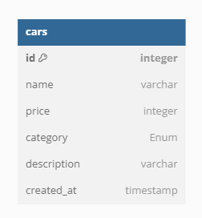

Ini adalah database diagram yang saya gunakan pada challenge 4:

Tata cara untuk membuka file ini:

1. clone repository ini
2. npm install express morgan pg pg-hstore sequelize sequelize-cli nodemon
3. buat file .env sesuai dengan contoh .env.example
4. edit package.json
5. edit config.json sesuai dengan database yang kamu gunakan
6. npm run dev
